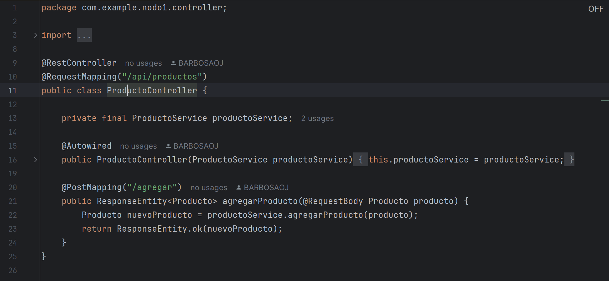
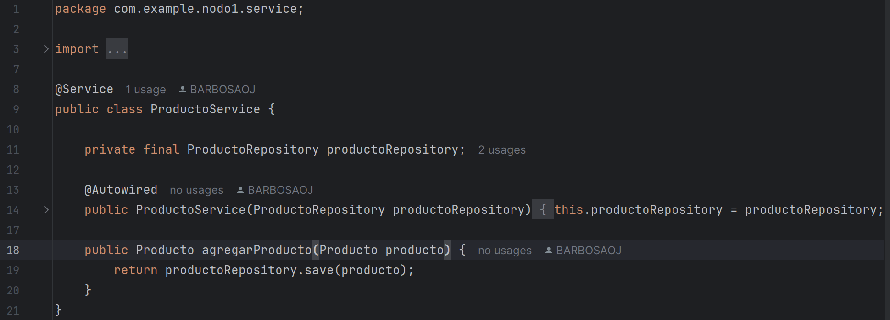
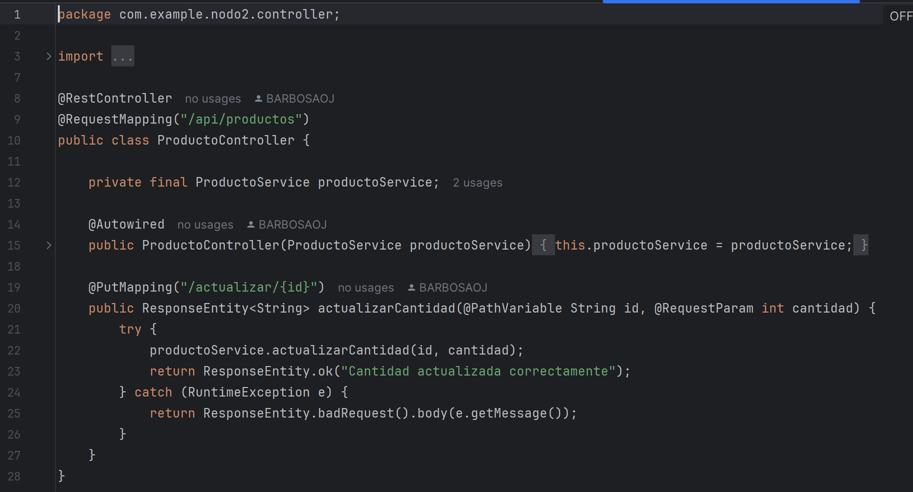
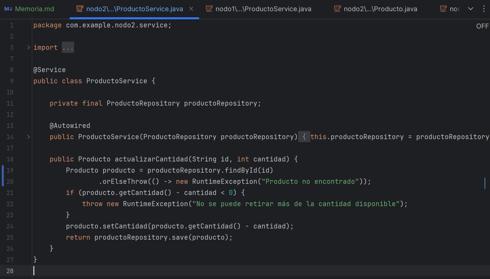
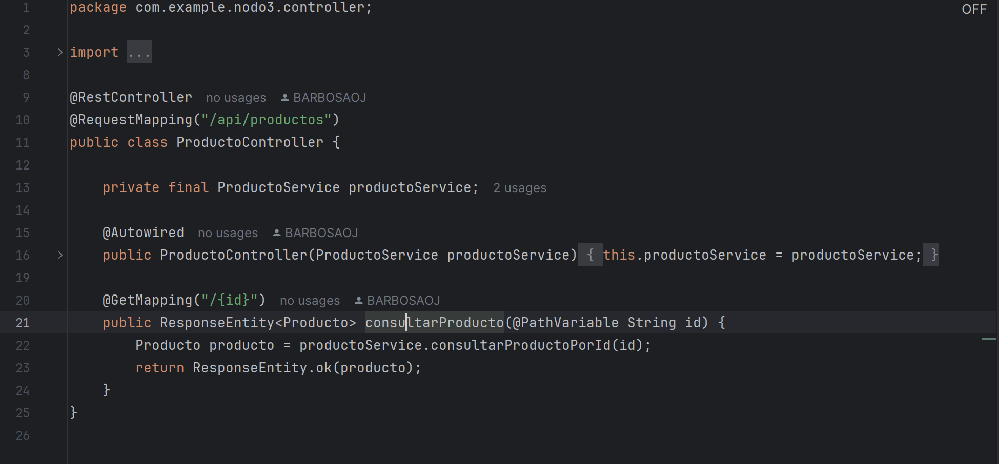
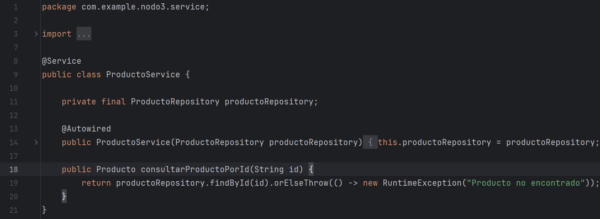
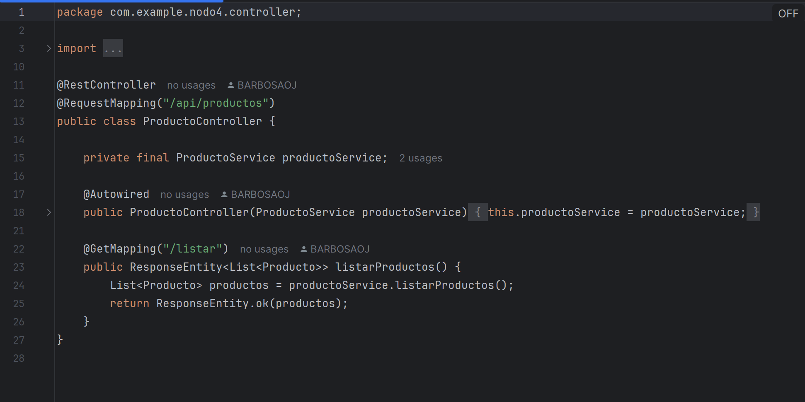
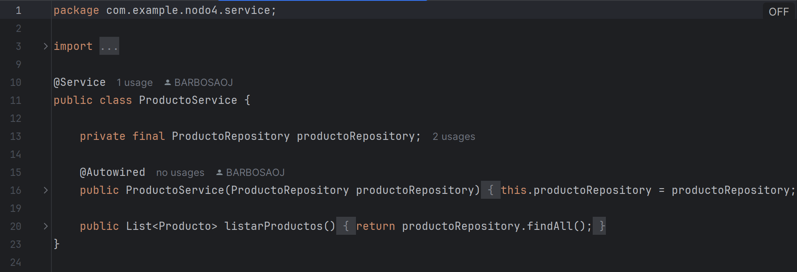

# Memoria – Nube distribuida para el control de inventario

## Participantes
- Pablo Barbosa
- Assil Brika
- Augusto Perrone
- Daniel Sousa

---

## Índice

1. [Problema a resolver](#problema-a-resolver)
2. [Tecnologías necesarias](#tecnologías-necesarias)
3. [Resolución del problema](#resolución-del-problema)
    - [Creación de la base de datos en MongoDB](#creación-de-la-base-de-datos-en-mongodb)
    - [Nodos](#nodos)

---

## Problema a resolver

**“Se pide un sistema distribuido para gestionar un inventario de productos utilizando Firebase como base de datos y 4 nodos ejecutándose en contenedores Docker. Cada nodo tiene una función específica dentro del sistema.”**

### ¿Qué es el sistema distribuido que nos piden?

Más bien estamos ejecutando una nube distribuida ya que nuestro programa cuenta con una serie de nodos que se gestionan desde un servidor Docker, pero no están físicamente presentes.

> “La nube distribuida es un servicio de computación en la nube que le permite ejecutar una infraestructura de nube pública en varias ubicaciones —los centros de datos de su proveedor de nube, los centros de datos de otros proveedores de nube, centros de datos o centros de colocación de terceros y ubicaciones locales— y gestionarlo todo desde un único plano de control.” *(IBM)*

Lo que unifica esta nube distribuida es una tecnología conocida como API REST. La API (interfaz de programación de aplicaciones) nos permite comunicar los diferentes servicios (nuestros nodos) para que cada función que empleen en el sistema tenga algún tipo de valor. Sin la API, nuestro código por muy bien hecho que esté no se puede ejecutar porque no está unificado.

### ¿Qué es una arquitectura API?

Una arquitectura API no es única. La forma más sencilla de explicar una API es diagramar la relación entre un cliente y un servidor; la API trabaja con ambos extremos para devolver respuestas. Este servicio de mensajería tiene múltiples variantes, pero en nuestro caso utilizamos la API REST:

> “El cliente envía las solicitudes al servidor como datos y el servidor utiliza esta entrada del cliente para iniciar funciones internas y devuelve los datos de salida al cliente.” *(Amazon Web Services)*

---

## Tecnologías necesarias

Se utilizarán las siguientes tecnologías:

- **MongoDB**
- **Docker**
- **Spring**

---

## Resolución del problema

### Creación de la base de datos en MongoDB

Para agilizar el proceso de desarrollo entre los integrantes y facilitar la entrega del trabajo usamos Docker, una herramienta que maneja contenedores de aplicaciones. Dentro de Docker creamos nuestra base de datos MongoDB para guardar el inventario de productos con los que trabajaremos.

---

### Nodos

Para crear el sistema distribuido, debemos repartir las tareas entre los diferentes nodos que conforman el sistema. En este caso:

#### Nodo 1: Agregar productos
Este nodo se encarga de agregar nuevos productos al inventario.

El codigo que se observa es el controlador del nodo 1. Se aprecia el uso del mapeo en el método "agregarProducto" y el propio uso del repositorio para guardar correctamente el producto.

Los metodos del servicio en el nodo 1 son los que se encargan de guardar en el repositorio los productos. Se llaman desde el controlador para mantener una estructura limpia.

#### Nodo 2: Actualizar cantidad
Este nodo modifica las cantidades de un producto existente en el inventario, asegurando que no se puedan retirar más unidades de las disponibles.

Controlador del nodo 2.

Servicio del nodo 2.

#### Nodo 3: Consultar información
Este nodo responde a solicitudes de información sobre un producto específico.

Controlador del nodo 3.

Servicio del nodo 3.

#### Nodo 4: Consultar información
Este nodo genera un listado completo del inventario.

Controlador del nodo 4. 

Se puede observar como se retorna una lista con los Productos a diferencia de un único producto como puede ser el caso del nodo 3.

Servicio del nodo 4. 

Método que se encarga de retornar la lista de productos.